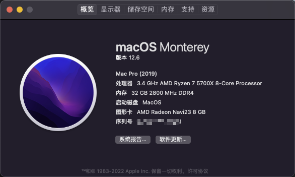

# B450 AORUS PRO WIFI + 5700X + RX6650XT

## 配置
| 规格     | 详细信息                       | 备注           |
|----------|--------------------------------|----------------|
| 主板     | B450 AORUS PRO WIFI (rev. 1.x) | BIOS版本：F63c |
| 操作系统 | macOS Monterey 12.6(21G115)    |                |
| CPU      | AMD Ryzen 7 5700X              |                |
| 显卡     | AMD RX6650XT 8G                | 华擎-挑战者    |
| 声卡     | Realtek ALC1220-VB             | layout：`7`    |
| 无线网卡 | Intel AX210 160MHz             | 已更换         |
| 有线网卡 | Intel I211                     |                |

> ⚠️ **修改三码之前请勿登陆AppleID**! 

## 功能快速预览
✅ 完美
⭕️ 能用但是有问题
❌ 不可用

| 功能/设备      | 能用 | 不可用 | 备注           |
|----------------|:----:|:------:|----------------|
| 板载声卡       |  ⭕️   |        | 麦克风无法使用 |
| 6650XT         |  ✅   |        |                |
| DP,HDMI        |  ⭕️   |        | DP音频无法输出 |
| 有线网卡       |  ✅   |        |                |
| 蓝牙           |  ✅   |        |                |
| WiFi           |  ✅   |        |                |
| 隔空投送       |  ✅   |        |                |
| CPU变频        |  ✅   |        |                |
| USB3.1 & TypeC |  ✅   |        |                |

## BIOS 设置
| 功能        |  选项   |
|-------------|:-------:|
| Fast Boot   | Enbale  |
| CSM Support | Disable |
| 4G 以上解码 | Enable  |

> 1. 未提及项目保持默认即可。
> 2. Fast Boot 如果在安装阶段无法引导设置为Disable，安装成功后就可以改回Enbale了。

## 关于显卡
1. 显卡需要通过SSDT仿冒6600XT，EFI 中的 SSDT 仅适用于当前型号主板。
2. SSDT是一位大佬免费帮我做的，DP音频 等显卡相关问题暂时无法解决。
3. 开机引导完毕后会黑屏2~3s，之后能正常进入桌面。
4. 设备太老 HDMI 音频未测试，HDMI 转 DVI 显示正常。

## 关于声卡
1. 声卡这块我没有详细测试，hackintool 探测到的 `layout-id = 7` 注入之后输出正常，麦克风无法使用。但在查资料的过程中发现有使用`layout-id = 1`的，但实测下来也是只有音频输出。  
2. 麦克风的问题可以使用蓝牙、USB声卡、IPhone等方案解决，我平时使用一副自带DAC的耳机作为替代。

## 关于有线网卡
1. I211 在 12.6 上已经无法继续使用 `SmallTreeIntel82576.kext` 驱动，改用 [AppleIGB.kext](https://github.com/donatengit/AppleIGB/releases)
2. 论坛有人反馈虚拟机桥接可以获取网关、IP但是无法上网，有虚拟机需求的请看 [原链接](http://www.imacosx.cn/11775.html)

## 关于NTFS的碎碎念
1. 关于NTFS我还要再啰嗦一遍，硬盘有价数据无价！
2. 放下对NTFS的执念，真想试验那么请不要对NTFS分区执行 **`写入`** 和 **`密集读取`** 操作
3. 双系统建议建立独立 `exFAT` 分区，作为文件交换使用
4. Seagate NTFS Paragon 文件随机损坏.png 

## 常用资源链接
[中文教程](https://hackintool.netlify.app/index.html#start)    
[中文教程](https://apple.sqlsec.com/1-基础知识/1-1.html) - [英文对照](https://dortania.github.io/OpenCore-Post-Install/#how-to-follow-this-guide)  
[资源&论坛](https://www.mfpud.com/macos/dmg/)